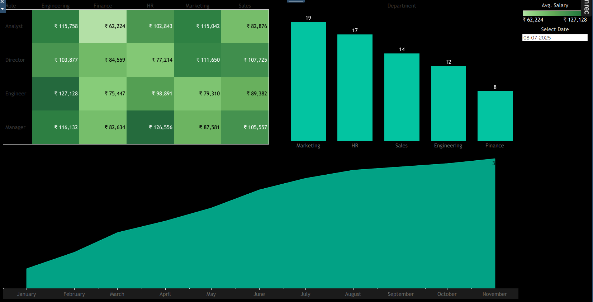

# 🚀 Enterprise HR Analytics: End-to-End Data Pipeline & Historical Data Warehouse

**[🔴 CLICK HERE TO VIEW THE LIVE INTERACTIVE TABLEAU DASHBOARD 🔴](https://public.tableau.com/views/hr_pipelinedashboard/Dashboard1?:language=en-GB&:sid=&:redirect=auth&:display_count=n&:origin=viz_share_link)**

[](https://public.tableau.com/views/hr_pipelinedashboard/Dashboard1?:language=en-GB&:sid=&:redirect=auth&:display_count=n&:origin=viz_share_link)
*(Click the image above to interact with the live "Time Machine" dashboard)*

---

## 📖 The Business Problem
In standard human resources databases, when an employee gets a promotion, changes departments, or receives a raise, their old record is simply overwritten. 

While this keeps current data clean, it destroys historical context. If the VP of HR asks, *"What was our engineering headcount and salary distribution exactly six months ago?"*, the system cannot answer. The company has lost its memory.

## 💡 The Solution
This project solves the historical data loss problem by engineering a fully automated, end-to-end data pipeline. 

Instead of overwriting data, this architecture ingests daily JSON event payloads (hires, promotions, terminations) and processes them using **Slowly Changing Dimension (SCD Type 2)** logic within a Microsoft SQL Server Data Warehouse. Finally, a dynamic Tableau dashboard sits on top of this warehouse, allowing stakeholders to "time-travel" and view the exact state of the workforce on any given day in history.

---

## 🏗️ Technical Architecture & Stack
* **Orchestration:** Apache Airflow
* **Data Extraction & Generation:** Python (`datetime`, `json`, `random`)
* **Data Ingestion:** Python (`pyodbc`, `os`)
* **Data Warehouse & Transformation:** Microsoft SQL Server (T-SQL, Stored Procedures, JSON Parsing)
* **Business Intelligence:** Tableau (Parameters, Calculated Fields, Advanced Filtering)

---

## ⚙️ The Data Pipeline Workflow

### 1. Data Simulation & Orchestration (Python & Airflow)
To simulate a real corporate environment, a Python script generates 365 days of unstructured JSON event logs. These daily payloads contain randomized data for new hires, departmental transfers, salary bumps, and terminations. The entire workflow is orchestrated using an **Apache Airflow DAG**, ensuring tasks run sequentially and fail gracefully.

### 2. Staging & Ingestion (SQL Server)
A Python worker script connects to the MS SQL Server via `pyodbc`, reading the raw JSON files from the local directory and loading them into a `raw_daily_events` staging table, preparing them for transformation.

### 3. Transformation & SCD Type 2 Logic (T-SQL)
The core engine of this project is a complex T-SQL Stored Procedure (`sp_process_daily_events`). It performs the following operations entirely within the database:
* **JSON Parsing:** Extracts nested attributes from unstructured text directly into relational columns using `JSON_VALUE`.
* **Historical Preservation (SCD Type 2):** When a promotion or transfer occurs, the procedure does not `UPDATE` and overwrite the row. It "retires" the active record by stamping an `end_date`, and `INSERT`s a brand new active row with the updated salary/department and a new `start_date`. 

### 4. Business Intelligence "Time Machine" (Tableau)
The Tableau dashboard is connected directly to the analytical dimension table. Utilizing advanced calculated fields and a dynamic date parameter, the dashboard filters out retired rows based on the user's selected date. 
* **Point-in-Time Headcount:** Bar charts dynamically re-sort based on historical staffing levels.
* **Salary Heatmap:** Highlights compensation disparities across roles and departments.
* **Attrition Tracking:** A cumulative area chart visualizes the precise days employees churned over a 12-month period.

---

## 📂 Repository Structure
```text
hr-data-pipeline/
│
├── airflow_dags/
│   └── hr_pipeline_dag.py          # Airflow DAG for pipeline orchestration
│
├── scripts/
│   ├── generate_hr_data.py         # Simulates 365 days of raw JSON events
│   └── ingest_daily_events.py      # Pushes raw JSON into SQL Server staging
│
├── sql/
│   ├── 1_create_schemas.sql               # DDL for staging and analytics tables
│   └── 2_sp_process_daily_events.sql      # Core SCD Type 2 Stored Procedure
│
├── dashboard_preview.png           # High-res screenshot for README
└── Enterprise_HR_Dashboard.twbx    # Raw Tableau Packaged Workbook
